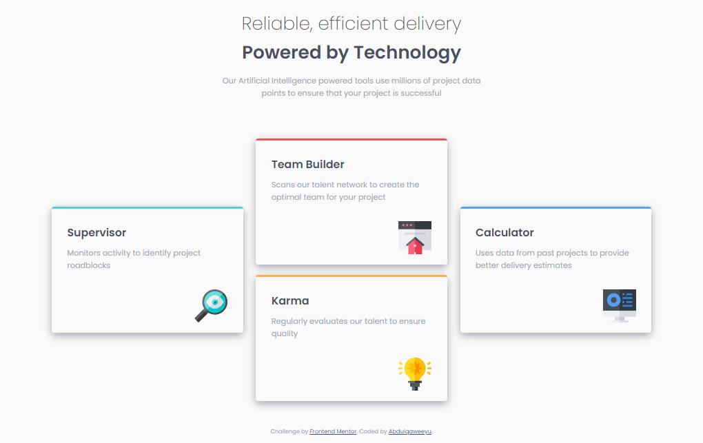
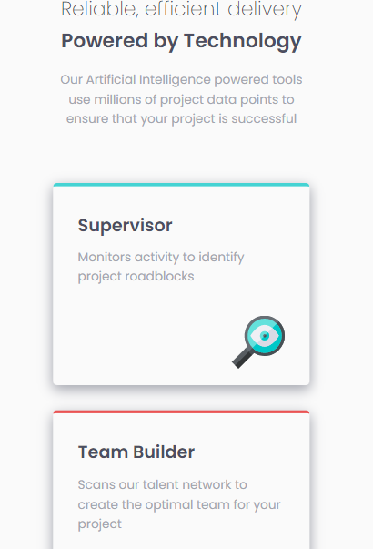
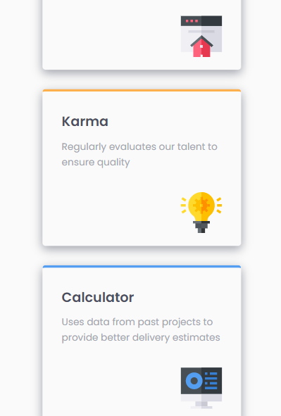

# Frontend Mentor - Four card feature section solution

This is a solution to the [Four card feature section challenge on Frontend Mentor](https://www.frontendmentor.io/challenges/four-card-feature-section-weK1eFYK). Frontend Mentor challenges help you improve your coding skills by building realistic projects. 

## Table of contents

- [Overview](#overview)
  - [The challenge](#the-challenge)
  - [Screenshot](#screenshot)
  - [Links](#links)
- [My process](#my-process)
  - [Built with](#built-with)
  - [What I learned](#what-i-learned)
  - [Useful resources](#useful-resources)
- [Author](#author)


## Overview

### The challenge

Users should be able to:

- View the optimal layout for the site depending on their device's screen size

### Screenshot






### Links

- Solution URL: [Solution Site](https://github.com/ABQ4539/four-card-feature-section)
- Live Site URL: [Four Card Feature Section](https://abq4539.github.io/four-card-feature-section/)

## My process

### Built with

- Semantic HTML5 markup
- CSS custom properties
- Flexbox
- Mobile-first workflow
- Responsive Web Design

### What I learned
- I learnt ho to add a `box-shadow` property by specifying 4 values; the vertical offset first then the horizontal offset followed by the blur effect and then the color of the shadow. An example is shown below:

- I also learnt how to center an element by setting the `margin-inline` property to `auto`.

```css
.card {
    box-shadow: 5px 5px 15px black;
    margin-inline: auto;
}
```

### Useful resources

- [Box-shadow Resource](https://www.w3schools.com/cssref/css3_pr_box-shadow.asp) - This helped me for the box-shadow problem.

## Author

- Frontend Mentor - [Abdulqaweeyu](https://www.frontendmentor.io/profile/ABQ4539)

